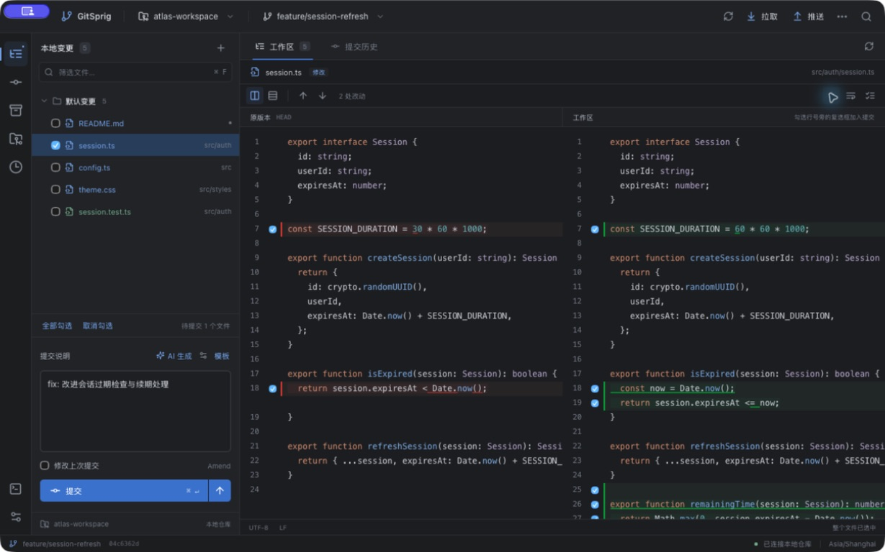
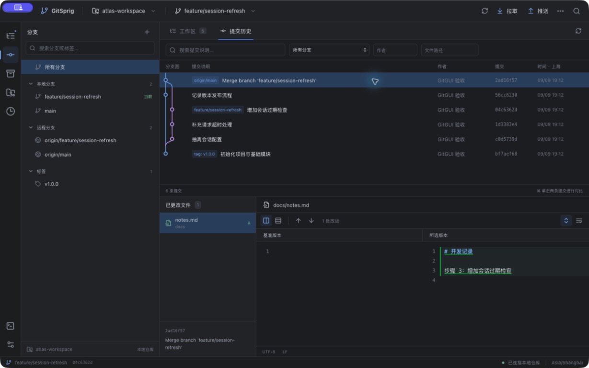

# 轻枝 · GitSprig

**进入 Vibe Coding，留住熟悉的 Git 体验。**

GitSprig 是一个为用惯 JetBrains Git 的开发者打造的轻量独立客户端，让熟悉的变更列表、差异审阅和提交操作，继续陪伴新的编码工作流。

“轻枝”里的“枝”对应 Git 分支，“轻”对应独立、轻量。Sprig 意为小枝，希望 Git 操作也能轻巧、顺手。

Tauri 2 · Rust · React · CodeMirror 6 · [MIT 开源](LICENSE)

支持 macOS 14 及以上的 Apple Silicon 设备。运行时需要 Git 2.40 或更新版本；无需启动 IDE。

[下载 macOS 版本](https://github.com/wangjunhaoo/gitsprig/releases/latest) · [安装说明](docs/INSTALL_MACOS.md) · [反馈问题](https://github.com/wangjunhaoo/gitsprig/issues)

## 为什么做 GitSprig

用了很多年 JetBrains 的 IDE：IntelliJ IDEA、PyCharm、WebStorm。除了写代码，它们内置的 Git 也早已成为习惯：看改动、选代码块、拆分提交、处理冲突，一套操作用下来很顺手。

到了 Vibe Coding 时代，我的日常工作逐渐转向 AI 编码工具，很多时候已经不需要再打开完整的 IDE。但代码写完之后，依然要审阅改动、整理提交和处理分支；这时最想用的，还是那套熟悉的 Git 操作。

于是出现了一个别扭的场景：**为了用 Git，又打开了一个很重的 IDE。** 想找一个独立的 Git GUI，却始终没有找到对自己来说同样顺手的替代品。

所以做了轻枝 GitSprig：把习惯的 Git 工作方式做成一件轻量、独立的工具，让它能和现在使用的 AI 编码工具一起工作。代码在哪里写都可以，审阅和提交依然顺手。

GitSprig 采用熟悉的多面板布局，支持右键菜单和快捷键，为日常审阅、提交与冲突处理提供独立入口。项目为独立实现，与 JetBrains 无隶属或官方合作关系。

## 界面预览

**工作区与差异审阅**：左侧选择本次提交内容，中央查看双栏差异，提交说明和 AI 生成入口就在手边。



**分支历史与提交详情**：在本地分支、远程分支和标签之间浏览，沿着分支图追踪提交，选中后查看对应文件改动。



截图使用虚构演示仓库。主要功能包括按文件/代码块/行提交、任务分组、分支拓扑图、三栏合并、交互式变基、Stash、工作树，以及兼容 OpenAI 格式的自定义 AI 提交说明。应用不建立项目代码索引。

## 有什么值得试一试

- **把资源花在 Git 上。** Tauri + Rust 使用系统 WebView，不捆绑另一套浏览器运行时，也不建立项目代码索引。历史和文件列表按需加载。
- **一份改动，可以拆成几次清楚的提交。** 按文件、代码块或行选择，按任务分组；提交前检查快照和已有暂存内容，遇到重叠冲突时停止，让你重新确认范围。
- **从审阅到冲突处理，在同一个工作区完成。** 双栏差异、分支图、逐行追溯、三栏合并、交互式变基和 Reflog 恢复集中在一个应用里。
- **继续使用自己的 Git 配置。** 调用系统 Git，沿用 SSH、凭据助手、钩子与签名；拉取默认仅快进，强制推送校验远端状态。
- **AI 提交说明，模型由你选择。** 支持自定义 OpenAI 兼容接口与模型，也可以连接本地服务。只有点击生成时才发送所选差异及必要上下文，生成后仍由你编辑、提交。
- **源码可读，也可以自己改。** 原创代码采用 MIT 许可证，提供本地构建方法、测试和公开验收记录。

“轻量”也需要接受实测检验：当前性能基线的启动中位数为 0.799 秒，但空闲 RSS 合计中位数约 251 MB，200 MB 的目标仍未达到。设备、测量方法和限制见 [验收记录](docs/ACCEPTANCE.md)。

## 使用

从 [GitHub Releases](https://github.com/wangjunhaoo/gitsprig/releases/latest) 下载 ARM64 安装包，打开 DMG，将 GitSprig 拖入 Applications 后启动。发行页同时提供源码压缩包、版本清单和 SHA256 校验值。

也可按照下方“开发与验证”从源码运行或构建安装包，直接运行 src-tauri/target/release/bundle/macos/GitSprig.app。

打开应用后选择本地仓库，也可以克隆或初始化新仓库。应用会记住最近仓库、主题、面板尺寸、提交草稿和变更分组。

克隆仓库时，先填写远程仓库的 HTTPS 或 SSH 地址，再选择本地保存目录，最后点击“克隆到本机”。本地目录是下载目标；选择位置时会根据仓库地址建议文件夹名称。

### 审阅与提交

- 左侧复选框选择整个文件。点击文件名查看差异。
- Shift + 点击文件名可连续多选，Command/Ctrl + 点击可增减单项；文件列表获得焦点后，也可使用 Shift + 上下键连续选择、Command/Ctrl + A 全选可见行。多选行用于右键批量操作。
- Shift + 点击复选框可批量勾选当前可见范围，空格可勾选或取消所选行；分组中的选择仅影响该组代码块，其他组的提交选择继续保留。“待提交”数量表示提交勾选范围。
- 右键可忽略所选精确路径，也可忽略所有位置的同名文件，例如 .DS_Store。规则写入根目录 .gitignore，原文件保留；“待加入 Git”的文件会清除所选项的意向暂存标记，其他暂存版本不受影响。已经正式跟踪的文件不自动取消跟踪。子目录反向规则仍生效时会提示核对。[Git 忽略规则说明](https://git-scm.com/docs/gitignore)
- 双栏编辑器行号旁的复选框选择单行；“逐行选择与变更分组”按钮打开代码块选择面板。
- 输入提交说明后提交。右侧向上箭头用于提交并推送。
- “修改上次提交”支持修改内容，也支持仅修改提交说明。
- 右键文件可查看历史、逐行追溯、移动变更组、处理已有暂存内容或丢弃整个文件的改动。
- 右键变更组可以重命名或删除分组。删除分组只改变组织方式，文件内容保留。

勾选只是选择本次提交范围，不会立即改写 Git 暂存区。应用使用临时索引生成提交，保留未选择的工作区及已有暂存内容。同文件的选择与已有暂存版本冲突时，提交会在创建新提交之前停止。

提交完成后清理对应的分组记录，剩余代码块按内容锚点继续归组。外部编辑或失败的多步操作导致无法可靠对应时，文件会显示“待归组”，重新分组后再提交。

### AI 生成提交说明

提交说明旁的设置按钮可配置接口地址、任意模型 ID、API Key 和生成偏好，也可在“查找操作”中搜索“AI”。兼容 [OpenAI Chat Completions](https://developers.openai.com/api/reference/resources/chat)：向接口发送 model/messages，读取 choices 中的文本结果。

- 地址可填含版本前缀的 Base URL（例如 `https://api.openai.com/v1`）或完整的 /chat/completions 地址。远程服务建议使用 HTTPS；本地服务支持 HTTP，且可不填密钥。
- AI 配置和 API Key 存入 `~/.gitgui/ai.json`，不使用钥匙串。文件为明文，macOS 下目录权限为 700、文件权限为 600，仅当前用户可读写；密钥不会回传到设置界面。同接口留空保留密钥，勾选“移除”明确删除。更换地址不会自动携带旧接口密钥。
- 勾选文件、代码块或行后点击“AI 生成”。只发送本次选择的差异及必要上下文，二进制、大文件和子模块只发送文件状态。差异超过 128 KB 时停止，需减少选择。
- 默认生成简体中文纯文本，也可自定义 Conventional Commits、语言和标题要求。生成结果可以编辑，不会自动提交或推送。
- 等待期间修改草稿，结果会进入预览，经确认再替换。取消、失败、仓库或选择变化均不会覆盖草稿。网络请求超时为 90 秒；取消停止本机等待，但服务端可能已经处理请求。

AI 只在点击生成时联网，不自动调用模型、不上传整个仓库。模型服务由使用者配置；应用不内置密钥或模型订阅。

从钥匙串版本更新后，请在 AI 设置中重新填写并保存接口、模型及 API Key；应用不会再访问或自动导出钥匙串。仓库、主题、草稿等原有偏好继续保留。

### 历史、分支与远程

“提交历史”展示分支图，可按分支、作者、路径和提交说明筛选。单击提交查看改动，按住 Command 选择两条提交比较版本。

右键分支可以切换、创建跟踪分支、合并、变基、重命名、设置上游或删除。右键提交可以挑选、撤销、创建分支与标签、重置或进入交互式变基。

顶部“更多 Git 操作”提供远程管理、标签、工作树、文件历史等入口。拉取默认只允许快进；遇到分叉时明确选择合并或变基。强制推送使用远端提交校验，远端发生变化时拒绝覆盖。

推送窗口的本地分支、远程仓库和目标分支均使用可搜索列表，支持上下键、Enter、Escape，以及直接输入新远程分支名。目标分支通过 [Git 远程引用查询](https://git-scm.com/docs/git-ls-remote) 从实际推送地址读取，包含尚未获取到本地的分支；支持刷新和取消读取。读取地址与推送地址不同时，以推送地址为准。

推送前显示完整方向，可选择是否设置该本地分支的上游。远程有多个推送地址时显示地址数量并读取其分支并集；普通推送按 Git 配置发送到全部地址，安全强制推送要求各地址的目标提交一致。仅推送选定的提交和目标分支，不附带其他分支或自动跟随标签。

### 冲突与变基

三栏分别显示两个来源和可编辑的结果。“共同祖先”可查看基线；下方按钮逐块接受左侧、右侧或双方，再按需手动编辑。

1. 保存结果：写入工作区，仍保留未解决状态。
2. 标记解决：确认结果后写入暂存区。
3. 继续：完成合并、变基或挑选流程。

变基时左侧是目标分支及已重放的提交，右侧是正在重放的提交。二进制和删除冲突使用文件级选择。

交互式变基可调整提交顺序、修改说明、暂停编辑、合并、压缩或删除提交。合并拓扑控制指令保留在原位。暂停后可以编辑剩余序列、继续、跳过或终止。

应用重新打开仓库时会识别 Git 当前进行中的操作，也能接续命令行发起的冲突处理。未保存的合并编辑在离开页面或关闭窗口时会提示确认。

### 暂存工作与恢复

- Stash：保存工作，选择是否包含未跟踪文件及保留暂存区；可预览工作区、原暂存区和未跟踪文件内容。
- 工作树：在独立目录中创建或打开其他分支，移除时要求工作树干净。
- 操作历史：查看 Reflog，并将历史提交恢复到新分支。

提交钩子照常运行。提交前钩子若改变了所选提交树，本次提交会停止。后置钩子新增的暂存改动会与原暂存内容合并；无法合并时保留两份索引，界面提供明确的恢复选择。

提交事务恢复记录位于该工作树 Git 内部目录的 `gitgui-recovery`。恢复时校验当前提交、索引及备份，后续发生过修改时拒绝自动覆盖。请先通过界面处理恢复记录，再执行其他写操作。

## 快捷键

| 操作                | macOS               |
| ------------------- | ------------------- |
| 打开仓库            | Command + O         |
| 准备提交            | Command + K         |
| 提交所选内容        | Command + Enter     |
| 推送                | Command + Shift + K |
| 本地变更            | Command + 0         |
| 提交历史            | Command + 9         |
| 刷新仓库            | Command + R         |
| 查找操作            | Command + Shift + A |
| 下一处 / 上一处差异 | F7 / Shift + F7     |
| 编辑器查找          | Command + F         |

## 轻量与边界

界面使用系统 WebView，Git 操作由 Rust 调用本机 Git。历史和文件列表按需读取，不建立项目代码索引；文件监听只针对当前活动仓库。

超过 5 MB 的文件默认显示摘要，可明确打开不超过 32 MB 的完整内容。非 UTF-8、内容过滤器、自定义编码和符号链接文件保持原始语义，必要时要求整体提交。子模块可查看状态并单独打开；Git LFS 沿用本机配置。

默认构建的 macOS 应用采用临时签名，未执行 Apple 公证；通过网络分享后可能触发未验证开发者提示，源码开源不会消除这一提示。长期分发需要 Developer ID 签名与 Apple 公证，详见 [Apple 分发说明](https://developer.apple.com/developer-id/)。Windows 和 Linux 尚未完成平台验收。GitSprig 不包含托管平台 PR 页面、JetBrains Shelf 私有格式、IDE 编辑功能或云同步。

首次安装提示的处理方法见 [macOS 安装说明](docs/INSTALL_MACOS.md)。

AI 配置保存在 `~/.gitgui/ai.json`；其他应用偏好保存在 macOS 的 `~/Library/Application Support/app.gitgui.desktop/`。不保存 Git 密码；Git 认证沿用凭据助手、SSH 和系统已有配置。使用 `GITGUI_DATA_DIR` 运行隔离验收时，AI 配置写入该测试目录下的 `.gitgui/ai.json`。

项目开发时暂名 GitGUI；正式名称为轻枝 GitSprig。存储目录和应用标识保留开发版的命名，已保存的仓库、草稿和 AI 配置可以继续使用。

## 开发与验证

需要 Node.js 22、Python 3、macOS 命令行开发工具和 Git。Rust 版本由 rust-toolchain.toml 固定；通过 rustup 使用项目时会读取该配置。项目包含前后端依赖锁文件。

```sh
env NODE_ENV=development npm ci --include=dev
npm run desktop
```

构建本机安装包：

```sh
npm run bundle
```

前端逻辑使用 Node 自带测试执行器，Rust 集成测试使用独立临时仓库和本机模拟远程：

```sh
npm test
npm run test:rust
```

编辑器桥接测试需要允许本机回环连接。Rust 脚本先编译，再分批执行，每批最多 60 秒。GitHub Actions 使用 macOS ARM64 检查格式、构建和测试。

AI 桌面验收可运行 `python3 scripts/ai_mock_server.py --output artifacts/ai-qa`，在应用中将接口设为 `http://127.0.0.1:18794/v1`，模型名称任意，密钥留空。脚本只监听本机；control.json 可调整响应文本、状态码和延迟，用于验证失败及取消。真实使用时改为自己的模型服务。

`scripts/create-fixtures.py` 创建可重复的桌面验收仓库，拒绝覆盖已有目录。`scripts/benchmark.py` 创建一万文件、五万提交的性能仓库，并记录进程冷启动、主进程和新增 WebKit 进程的内存合计。

最终测量结果和验收边界见 [验收记录](docs/ACCEPTANCE.md)。

## 参与与许可证

欢迎提交 Issue 和 Pull Request，参见 [贡献说明](CONTRIBUTING.md) 与 [安全报告](SECURITY.md)。

本仓库原创代码按 [MIT 许可证](LICENSE) 发布。依赖使用各自的许可证，主要直接依赖见 [第三方组件说明](THIRD_PARTY.md)。系统 Git 由使用者自行安装，不随应用捆绑。

项目介绍和可复用的社区分享稿见 [推广文案](docs/PROMOTION.md)。
